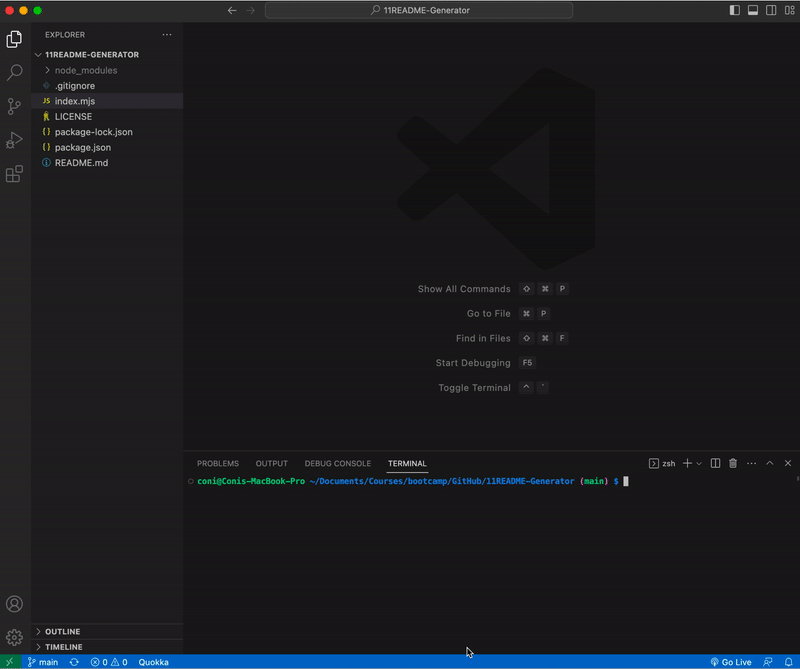

# Professional README Generator [](https://opensource.org/licenses/MIT)

## Description
This project aims to create a command-line application that can generate a professional README.md file for open source projects on GitHub. The application makes use of the Inquirer package to prompt the user for various information about the project, including:

* Project title.
* Sections entitled:
    * Description.
    * Table of Contents.
    * Installation instructions.
    * Usage information.
    * License used.
    * Contribution guidelines.
    * Tests instructions.
    * Questions section, that includes the user's GitHub and email address.

## Installation
To use this application, you will need to have Node.js installed on your computer. If you don't have Node.js installed, you can download it [here](https://nodejs.org/en/download/).
Once you have Node.js installed, you can clone this repository to your local machine.

After cloning the repository, navigate to the project directory and install the necessary dependencies by running the following command:

```javascript
npm install inquirer dedent
```

This will install [Inquirer](https://www.npmjs.com/package/inquirer), a command line interface for collecting user input, and [Dedent](https://www.npmjs.com/package/dedent), a string dedentation library that will help make the generated markdown file look cleaner.

## Usage
To use this application, run the following command:

```javascript
node index.mjs
```

After running the above command, you will be prompted with a series of questions about your project. Answer the questions as accurately and thoroughly as possible to generate a high-quality, professional README.

The generated README will be located in the same directory as index.mjs, and will be named generated-README.md.

Here's a GIF that shows how the application should work:



## Credits
This project was made possible with the guidance and support of my instructors and teaching assistants. I also used various resources to create this project, including:

* [Markdown guide](https://www.markdownguide.org/basic-syntax/) for reference on Markdown syntax.
* [Dedent documentation](https://www.npmjs.com/package/dedent?activeTab=readme) for formatting multi-line strings.
* [Inquirer documentation](https://www.npmjs.com/package/inquirer#documentation) for building interactive command-line interfaces.

## License
Please refer to the LICENSE in the repo.